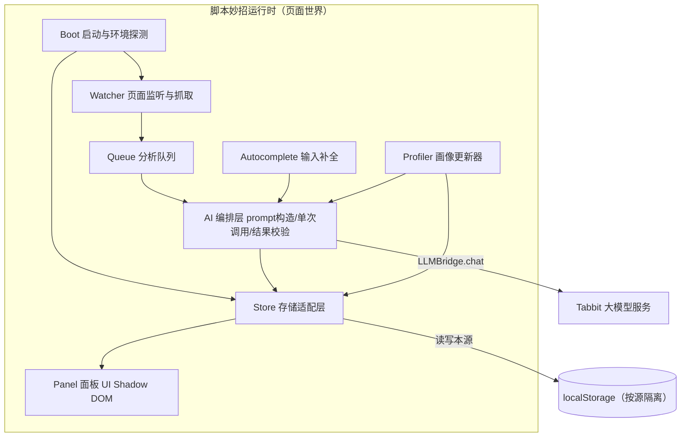
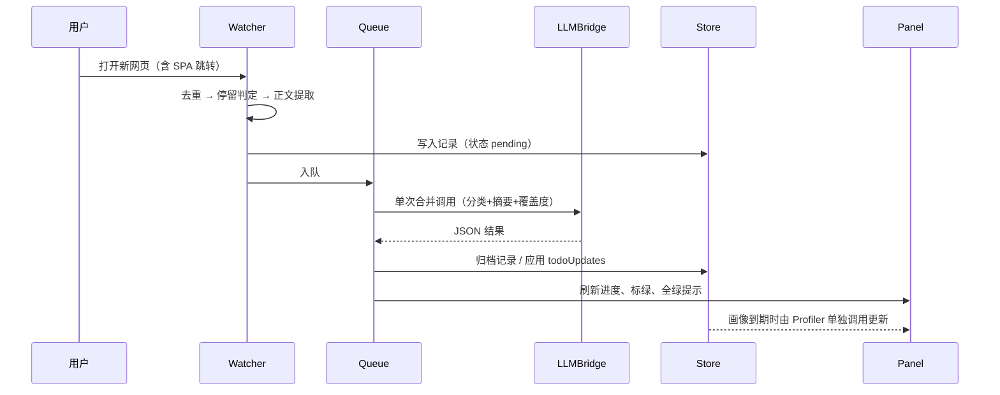

# 拾知（Tabbit 脚本妙招）开发技术方案

- 版本：v1.2（纯脚本妙招架构）
- 日期：2026-08-16
- 更新：v1.3 确认 Tabbit 无妙招级跨源存储 API，方案简化为每源独立 localStorage，不再考虑跨源同步（§4.2）
- 输入：`设计方案/需求.md`、`设计方案/架构图.jpg`、`脚本妙招是什么.md`、`llm-bridge-chat-guidance`
- 交付形态：一个 Tabbit 脚本妙招（单文件 JavaScript，页面上下文执行，通过 `LLMBridge.chat()` 调用大模型），无任何附加组件

---

## 1. 产品概述与范围

拾知是一个"工作模式"驱动的浏览助手，以脚本妙招形态运行，包含四个功能：

| 功能 | 代号 | 一句话说明 |
| --- | --- | --- |
| 自动记录+自动分析 | 博观约取，厚积薄发 | 工作模式下自动抓取网页、AI 分类归档到工作目标，无关网页归入"摸鱼" |
| 智能 to-do list | 浮光跃金，静影沉璧 | AI 将目标拆解为待办，按网页内容累计覆盖度，超阈值标绿，全绿提示收尾 |
| 输入自动补全 | 种字成林，妙笔生花 | 任意输入框内基于画像与上下文的续写，Tab 接受 |
| 用户画像 | 鉴水知源，润物无声 | 仿 Claude Code 记忆策略，定时/定量更新画像，注入所有 AI 调用 |

**v1 范围**：纯文本理解（正文提取 + LLM 分析）；本地持久化；单人单浏览器。
**非目标（v1 不做）**：多设备同步、服务端、网页截图多模态分析、浏览器历史导入、团队协作、自动操作网页（点击/填表自动化）。

---

## 2. 平台能力与硬约束

### 2.1 脚本妙招形态（来自《脚本妙招是什么》）

- 脚本在目标网页上下文内执行，可操作 DOM；刷新页面即还原。**它不是扩展**，访问不到 `chrome.*` 扩展 API；文档确认的唯一特权能力是 `LLMBridge`。
- 生效范围按 URL 配置，**已确认支持按匹配自动运行**（2026-08-14 确认）——拾知生效范围设为全部网址即可实现"打开网页即记录"。
- Tabbit 是 Chromium 浏览器，Web 平台行为与 Chrome 一致：`localStorage` **按源隔离**。本方案只在同源场景内生效，不做跨源存储（§4.2）。

### 2.2 LLMBridge 调用红线（来自 llm-bridge-chat-guidance，必须遵守）

1. **禁止在循环中调用** `LLMBridge.chat()`——所有分析必须串行队列化。
2. **能合并就合并**——一次页面分析把"分类 + 摘要 + 覆盖度评估"合并为单次调用。
3. JSON 结构化输出用 `"json"` 简写或 `{ response_format: "json" }` 对象写法；若同时传媒体必须用对象写法（v1 纯文本，不涉及）。
4. 只发送任务必需的内容——正文摘录要截断，控制 token 消耗。
5. 媒体理解耗时更长且受限流约束——v1 不用 `images/videos/audios`。

由此得出核心设计原则：**"一页一调用"**——每个网页无论触发多少功能，至多产生一次 LLM 分析调用；补全功能是唯一的例外通道（交互实时性要求），单独限流。

---

## 3. 总体架构

单一脚本妙招（单文件 IIFE，页面上下文运行，无任何附加组件）。脚本内部分为 8 个模块段，核心逻辑（解析、合并、队列、截断、覆盖度贡献合并）与 DOM 解耦，便于用 Node 做纯函数单测。



主流程（对应架构图 F1+F2 链路）：



---

## 4. 数据模型与存储

### 4.1 存储键（统一前缀 `shizhi.`）

```jsonc
// shizhi.state —— 工作模式
{ "workMode": true, "activeSince": 1755187200000 }

// shizhi.goals —— 工作目标（active 上限 10 个）
[{
  "id": "g1", "title": "调研竞品 X 的定价策略",
  "status": "active | done | archived", "createdAt": 0,
  "todos": [{
    "id": "t1", "text": "找到官方定价页并记录档位",
    "contrib": { "r12": 15, "r27": 10 },  // 记录id → 贡献分；同记录重复入账幂等
    "coverage": 25,               // 导出值：min(100, Σcontrib)，单调不减
    "status": "open | done",      // coverage >= 阈值 → done（标绿）
    "manual": false               // 用户手动勾选后，AI 不再改动
  }]
}]

// shizhi.records —— 浏览记录（环形缓冲，上限 500 条或 30 天）
[{
  "id": "r27", "url": "...", "origin": "...", "title": "...",
  "capturedAt": 0, "dwellMs": 0,
  "excerptHash": "fnv1a",          // 去重键
  "category": "pending | goal:g1 | slacking | error",
  "summary": "...", "keywords": ["..."],
  "todoApplied": false             // 覆盖度是否已入账（幂等）
}]

// shizhi.profile —— 用户画像（AI 记忆）
{
  "version": 7, "updatedAt": 0,
  "facts": ["用户是前端工程师，关注性能优化"],   // 上限 60 条
  "preferences": ["偏好结构化、带对比表格的内容"],
  "style": "表达简洁直接，少用形容词，中英混排",        // ≤120 字，供补全使用
  "sourceRecordCount": 143
}

// shizhi.queue —— 持久化分析队列（刷新不丢）
[{ "recordId": "r27", "retries": 0, "nextAt": 0 }]

// shizhi.settings
{
  "coverageThreshold": 80,         // 标绿阈值（%）
  "profileEveryRecords": 20,       // 每积累 N 条记录触发画像更新
  "profileMinIntervalH": 12,       // 画像更新最小间隔（小时）
  "contentMaxChars": 3000,         // 正文摘录截断
  "profileInjectChars": 800,       // 注入 prompt 的画像上限
  "autocompleteEnabled": true,
  "excludedSites": ["mail", "bank"]   // 子串匹配，命中不记录不补全
}
```

### 4.2 存储适配层（Store）

**已确认的平台现实（2026-08-16）**：脚本妙招运行在网页上下文，不是扩展，访问不到 `chrome.storage` 等任何扩展 API；Tabbit 未提供妙招级跨源存储（`sharedStorage` 为空对象、无 `GM_*` 或 `TabbitStorage` API 注入）；`localStorage` 按源隔离且第三方 iframe 存储再按顶级站点分区。由此确定：**本方案只在同源场景内生效，不做跨源存储**。

Store 直接采用**每源独立 localStorage**：

- 各站点读写本源 `localStorage`，键名加 `shizhi.` 前缀避免冲突。
- 内存缓存 + 写穿透 + 同源多标签 `storage` 事件联动。
- 面板显示当前站点存储状态与上次写入时间；不再提示跨站同步。

所有写操作走 `Store.set(key, value)`，内部 JSON 序列化、加 `v` 版本字段，读取时按版本迁移。记录表写入即落盘，分析只改状态字段，保证刷新后队列可恢复。


## 5. 核心流程设计

### 5.1 工作模式生命周期

```text
关闭 --(面板开关)--> 开启（无目标）--(添加 ≥1 目标)--> 记录中
记录中 --(全部目标 done/archived)--> 开启（无目标）
任意状态 --(关闭)--> 关闭：停止记录与补全，已存数据保留
```

- `workMode` 持久化；脚本每次注入后读取，决定 Watcher 是否激活。
- 补全功能独立于工作模式，有自己的总开关。

### 5.2 页面抓取与记录（Watcher）

触发时机（取并集，去抖 500ms）：

- 初始加载：`DOMContentLoaded` 后。
- SPA 跳转：hook `history.pushState/replaceState`，监听 `popstate/hashchange`；另用 `MutationObserver` 盯 `<title>` 变化补漏。

```javascript
const fire = () => setTimeout(onLocationChange, 500);
for (const m of ["pushState", "replaceState"]) {
  const orig = history[m];
  history[m] = function (...args) {
    const r = orig.apply(this, args);
    fire();
    return r;
  };
}
addEventListener("popstate", fire);
addEventListener("hashchange", fire);
```

入队前四道闸：

1. **模式闸**：`workMode` 开且存在 active 目标。
2. **站点闸**：URL 不命中 `excludedSites`。
3. **去重闸**：同 `origin+path` 且 `excerptHash` 相同的记录 30 分钟内不重复入队。
4. **停留闸**：页面可见且连续停留 ≥ 3 秒才落记录，防秒开秒关污染数据。

正文提取（无依赖，Readability 精简版约 120 行）：

- 候选容器：`<article>` > `<main>` > 文本密度最高的 `<div>`。
- 取标题（`document.title` + 首个 `<h1>`）、`meta[name=description]`、正文纯文本，按 `contentMaxChars`（默认 3000）截断。
- 计算 `excerptHash`（FNV-1a，约 10 行）用于去重。

通过闸门后写入 `records`（`pending`），入 `queue` 落盘，Queue 启动消费。

### 5.3 分析队列与单次调用策略（Queue + AI）

Queue 规则：

- **严格串行**，两次调用间隔 ≥ 2s；同时只有一个 in-flight。
- 失败（网络/限流/JSON 解析失败）指数退避：5s → 15s → 60s，重试 3 次后记录标 `error`，继续消费下一条。
- 队列持久化，脚本注入时若发现残留队列直接续跑。

单次合并调用（**一页仅此一次**）：

```javascript
const result = await LLMBridge.chat(buildPagePrompt(page, goals, profile), "json");
// result = { relevant, goalId, summary, keywords, todoUpdates: [{todoId, delta, reason}] }
```

Prompt 结构（完整模板见附录 B）：

1. 角色：拾知分析器，只输出 JSON。
2. 用户画像摘录（≤ `profileInjectChars`，未生成时省略）。
3. 全部 active 目标及其 open 待办（id + 文本 + 当前覆盖度）。
4. 网页 URL / 标题 / 正文摘录。
5. 输出契约：`relevant`、`goalId`（不相关为 `null` → 摸鱼）、`summary`（≤80 字）、`keywords`、`todoUpdates`（delta 0-25，无贡献不返回该项）。

结果处理（幂等）：

- JSON 解析失败先做一次修复（去代码围栏、截取首个 `{...}`），仍失败走退避。
- `category = relevant ? "goal:"+goalId : "slacking"` 写回记录。
- `todoApplied === false` 时才应用 `todoUpdates`：`contrib[recordId] = clamp(delta, 0, 25)`（同一记录重复入账只是覆盖同值，天然幂等），`coverage = min(100, Σcontrib)` 重算，置 `todoApplied = true`。
- 触发 toast：「已归档至：{目标名}」或「已归入摸鱼」。

### 5.4 智能 to-do list（覆盖度引擎）

**生成**：用户在面板保存/编辑目标后，一次性调用（非循环）：

```javascript
const { todosByGoal } = await LLMBridge.chat(buildTodoPrompt(goals, profile), "json");
// 每个目标拆 3-8 条可核验的信息收集待办
```

**更新**：来自 §5.3 的 `todoUpdates`，规则：

- `coverage >= coverageThreshold`（默认 80）→ `status = done`，面板标绿。
- 目标下全部待办 done → 面板顶部出现完成横幅：「{目标} 信息收集已完成」，两个动作：**关闭项目**（`status=done`）、**追加子目标**（一次 LLM 调用建议 3 条候选，用户勾选确认后并入待办，重置该目标为 active）。
- 贡献只加不删，覆盖度单调不减；用户可手动勾选/取消待办（置 `manual: true`，AI 不再改动该项）。

### 5.5 输入自动补全（Autocomplete）

独立于记录链路，实时通道，单独限流。

**字段识别**（事件委托 + MutationObserver 覆盖动态插入）：

- 目标：`input[type=text/email/search/url]`、`textarea`、`[contenteditable=true]`。
- 排除：`password/hidden/number/tel`、`readonly/disabled`、name/id/label 命中敏感词（`pass|pwd|cvv|card|secret|token|验证码`）、命中 `excludedSites` 的站点。

**触发与限流**：

- 输入停止 800ms 且字段内已输入 ≥ 6 字符时发请求。
- 同时在飞 ≤ 1；新输入使旧请求作废（请求序号比对）。
- 上下文包：字段 label/placeholder/name、字段尾部 500 字符、页面标题、画像 `style` 字段。

**渲染与接受**（ghost text）：

- `input/textarea`：镜像 div 法——复制目标元素 computed style（font/padding/border/line-height/box-sizing），绝对定位覆盖在字段上，已输入部分透明、续写部分灰色；随 scroll/resize 同步。
- `contenteditable`：在当前 Range 处插入 `contenteditable=false` 的灰色 `<span data-shizhi-ghost>`，下次输入前移除。
- **Tab** 接受 / **Esc** 拒绝 / 任意继续输入取消。Tab 键仅在存在 ghost 时拦截，否则透传，不破坏原生焦点流转。

框架兼容写入（React/Vue 受控组件关键）：

```javascript
function insertAtCaret(el, text) {
  if (el.isContentEditable) {
    document.execCommand("insertText", false, text); // 触发浏览器原生输入链路
    return;
  }
  const proto = el.tagName === "TEXTAREA" ? HTMLTextAreaElement.prototype : HTMLInputElement.prototype;
  const setter = Object.getOwnPropertyDescriptor(proto, "value").set;
  const s = el.selectionStart ?? el.value.length, e = el.selectionEnd ?? el.value.length;
  setter.call(el, el.value.slice(0, s) + text + el.value.slice(e));
  el.selectionStart = el.selectionEnd = s + text.length;
  el.dispatchEvent(new Event("input", { bubbles: true })); // 让框架感知
}
```

### 5.6 用户画像（Profiler）

仿 Claude Code 记忆：**增量合并、去重、限容量、带版本**。

- 触发：`sourceRecordCount` 每 +`profileEveryRecords`（默认 20）且距上次 ≥ `profileMinIntervalH`（默认 12h）。
- 单次调用：现有画像 JSON + 最近 N 条记录摘要，合并为新画像（facts ≤ 60 条，丢弃过期事实，提炼 `style`）。
- 更新后 `version++`，旧版本保留最近 2 份供回滚。
- 消费方：§5.3 分析 prompt（facts+preferences 摘录）、§5.5 补全 prompt（style）、§5.4 待办生成 prompt。画像为空时各环节优雅降级（省略该段）。

---

## 6. UI 设计

生产工具定位：安静、密集、可扫描，无营销元素。全部 UI 挂在 **Shadow DOM** 内，与页面样式完全隔离；z-index 控制在合理区间，不遮挡页面原有浮层。

- **入口**：页面右下悬浮按钮（灯泡意象，与 Tabbit 妙招一致），拖动可移位，位置记忆。
- **面板**（宽 360px，四个 Tab）：
  - **目标**：目标列表（增删改、状态徽章）、展开显示待办进度条（绿色=done）；全绿横幅与收尾按钮也在此。
  - **记录**：按目标分组的时间线，摸鱼单独一组；每条显示标题/时间/摘要，支持手动改归档（下拉换目标）。
  - **画像**：facts/preferences/style 只读展示 + 「立即更新」按钮 + 版本时间。
  - **设置**：阈值、画像频率、站点黑名单、补全开关、数据导入导出（JSON）、清空数据。
- **Toast**：归档结果、错误、画像更新，3 秒自消。
- **Ghost text**：`opacity 0.4`，与字段字体严格一致，不引起布局抖动（镜像 div `pointer-events: none`）。

---

## 7. 隐私与安全

1. 数据全部本地存储（localStorage，不出设备）；只有工作模式开启时，页面摘录才会发给 LLM。
2. 站点黑名单同时作用于记录与补全；默认建议用户加入邮箱、网银、企业内部系统。
3. 补全永远排除密码/支付/验证码类字段（§5.5 排除规则）。
4. 「清空数据」一键删除所有 `shizhi.*` 键。
5. 正文提取只取渲染文本，不读取任何表单已填内容（补全除外，且仅限当前聚焦字段尾部 500 字符）。

---

## 8. 调用频率与资源预算

| 场景 | 频率上限 | 单次输入规模 |
| --- | --- | --- |
| 页面分析 | 每页 1 次，串行间隔 ≥2s | 摘录 3000 字符 + 目标/画像 ≤1200 字符 |
| 待办生成 | 每次目标保存 1 次 | 目标文本 ≤800 字符 |
| 画像更新 | ≥12h 且每 20 条记录 1 次 | 画像 + 20 条摘要 ≤2500 字符 |
| 输入补全 | 交互触发，debounce 800ms，在飞 ≤1 | 字段尾部 500 字符 + style ≤120 字符 |

按重度使用估算：每小时 30 页约 30 次分析调用 + 补全约 20 次，符合"合并调用、避免循环"的限流要求；429/错误统一走 Queue 退避。

---

## 9. 代码组织与构建

- 交付：单文件 IIFE（脚本妙招直接粘贴/导入即可运行）。
- 仓库组织：`src/` 下按模块分段（`boot / store / extract / queue / ai / panel / autocomplete / profiler / index`），用 esbuild 打成单文件 IIFE；不引入任何运行时依赖。早期里程碑（M1）可直接手写单文件，结构稳定后再拆模块。
- 纯逻辑（`extract` 截断、JSON 修复、覆盖度贡献合并、画像合并、队列退避、prompt 构造）放在 `src/core/`，不触碰 DOM，供 Node 单测直接引用。
- 启动骨架：

```javascript
(() => {
  "use strict";
  if (window.__shizhiLoaded) return;            // 防重复注入
  window.__shizhiLoaded = true;
  if (typeof LLMBridge === "undefined") return; // 非 Tabbit 环境静默退出
  // boot(): 初始化存储 → 读配置 → 恢复队列 → 挂监听 → 渲染入口按钮
})();
```

---

## 10. 测试与验收

### 10.1 纯函数单测（Node，覆盖 `src/core/`）

JSON 修复（围栏/截断/脏文本）、覆盖度 clamp 与幂等应用、画像合并去重与容量裁剪、队列退避序列、摘录截断与 hash 稳定、prompt 构造的画像降级分支。

### 10.2 手动验收矩阵（对照架构图）

| 编号 | 场景 | 预期 |
| --- | --- | --- |
| A1 | 开启工作模式，设 2 个目标，打开相关网页 | 落记录，toast「已归档至目标X」，记录入对应分组 |
| A2 | 打开无关娱乐页 | 归入摸鱼分组 |
| A3 | SPA 站内跳转（pushState） | 产生新记录，不重复分析同内容 |
| A4 | 秒开秒关页面（小于 3s） | 不产生记录 |
| A5 | 刷新页面 | 面板数据、队列、目标全部保留 |
| A6 | 新标签页直接打开网址（不点妙招） | 脚本自动运行并正常记录 |
| A7 | 同站开两个标签页 | storage 事件联动，数据即时一致 |
| B1 | 保存目标 | 自动生成 3-8 条待办 |
| B2 | 连续浏览相关页 | 覆盖度单调上升至阈值后标绿 |
| B3 | 全部待办标绿 | 出现完成横幅，可关闭项目/追加子目标 |
| C1 | 普通输入框输入停顿 | 出现灰色续写，Tab 接受、Esc 取消 |
| C2 | React 受控输入框 | 接受后框架状态同步（页面计数器/校验即时更新） |
| C3 | 密码框/黑名单站点 | 无任何补全行为 |
| D1 | 累计 20 条记录 | 画像 version+1，facts 更新 |
| D2 | 无画像时 | 分析/补全正常降级，不报错 |

---

## 11. 风险与开放问题

| # | 风险 | 影响 | 缓解 / 回退 |
| --- | --- | --- | --- |
| R1 | ~~自动运行能力未明~~ 已解决：确认支持自动运行（2026-08-14） | 无 | 生效范围设为全部网址；M0 做一次实机确认即可 |
| R3 | LLMBridge 限流数值未知 | 排队积压、补全超时 | 串行+间隔+退避的保守默认；M0 实测后调参 |
| R4 | ~~LLMBridge 所在 JS 世界~~ 已解决：脚本运行于页面上下文，`LLMBridge` 同世界可用（2026-08-14 确认） | 无 | M0 顺手实测即可 |
| R5 | 多标签页同时运行 | 同源写冲突、重复分析 | 同源：storage 事件联动 + 记录 id 最后写入胜出 + contrib 幂等 |
| R6 | 脚本体积/性能限制未知 | 超限被拒 | 无依赖、Readability 精简版，目标 gzip 小于 40KB |
| R7 | LLM 返回 JSON 不稳定 | 分析失败 | 修复重试 + 退避 + error 态可视，不阻塞后续记录 |

**M0 平台验证清单（开工第一件事，约 0.5 天）**：① 自动运行生效范围实机配置（R1）；② `LLMBridge` 可达性与限流手感（R3/R4）；③ 脚身体积限制（R6）。结论回填本文档。

---

## 12. 里程碑

| 里程碑 | 内容 | 工期估算 | 验收 |
| --- | --- | --- | --- |
| M0 | 平台探查（自动运行 / 限流 / 体积） | 0.5 天 | R3/R6 有结论 |
| M1 | 记录+分类主链路（F1）+ Store + 面板目标/记录 Tab | 2-3 天 | 验收矩阵 A1-A7 |
| M2 | 智能 to-do（F2） | 1-2 天 | B1-B3 |
| M3 | 用户画像（F4） | 1 天 | D1-D2 |
| M4 | 输入补全（F3） | 2-3 天 | C1-C3 |
| M5 | 加固打磨：设置页、性能、文案 | 1-2 天 | 全矩阵回归 |

合计约 8-12 人日（不含 M0 结论导致的方案调整）。

---

## 附录 A：页面分析调用示例

```javascript
async function analyzePage(record, goals, profile) {
  const prompt = buildPagePrompt(record, goals, profile); // 见附录 B
  let raw;
  try {
    raw = await LLMBridge.chat(prompt, "json");
  } catch (err) {
    throw new RetryableError(err); // 交给 Queue 退避
  }
  const result = parseJsonLoose(raw); // 围栏剥离 + 首个 {...} 截取
  validatePageResult(result, goals);  // goalId/todoId 必须存在，delta clamp 0-25
  return result;
}
```

## 附录 B：Prompt 模板集

**B1 页面分析（单次合并调用）**

```text
你是"拾知"分析器。根据用户画像、工作目标与待办，分析网页内容。只输出 JSON。

[用户画像]
{profileExcerpt}  // 无画像时整段省略

[工作目标与待办]
1. 目标 g1：{title}
   - t1 {todo}（当前覆盖 {coverage}%）

[网页]
URL: {url}
标题: {title}
正文摘录: {excerpt}

输出 JSON：
{
  "relevant": true|false,        // 是否与任一目标相关
  "goalId": "g1"|null,           // 最相关目标；不相关为 null（即摸鱼）
  "summary": "≤80字页面摘要",
  "keywords": ["..."],
  "todoUpdates": [{"todoId":"t1","delta":0-25,"reason":"≤30字"}]
}
规则：delta 表示该页面对此待办的新增信息覆盖贡献；无贡献的待办不要出现；不确定时取小值。
```

**B2 目标拆待办**

```text
把以下工作目标各拆解为 3-8 条"通过浏览网页即可核验完成"的信息收集待办。只输出 JSON。
[用户画像] {profileExcerpt}
[目标] 1. g1 {title} ...
输出：{"todosByGoal": {"g1": [{"id":"t1","text":"..."}]}}
```

**B3 画像合并**

```text
你是记忆管理器。把近期浏览摘要合并进用户画像：去重、修正过期事实、保留高价值偏好，
并从用户常读内容中提炼写作风格。只输出 JSON。
[现有画像] {profileJson}
[近期记录摘要] {summaries}
输出：{"facts":["...≤60条"],"preferences":["..."],"style":"≤120字写作风格描述"}
```

**B4 输入补全**

```text
根据用户写作风格与上下文，续写用户正在输入的内容。
[风格] {profile.style}
[场景] 页面《{title}》的「{fieldLabel}」输入框
[已输入] ...{tail}
只输出续写文本（≤60字，不重复已输入内容，不加解释）。
```
